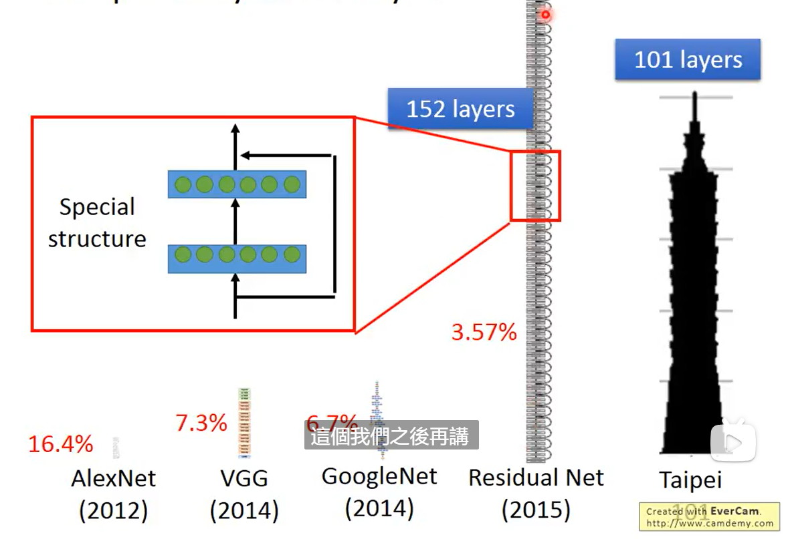
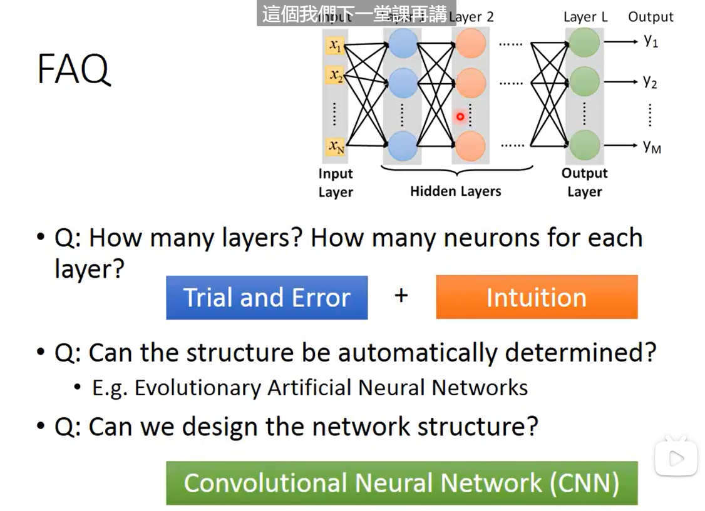
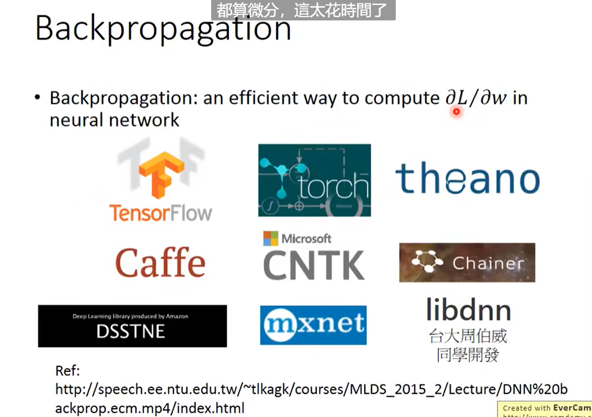

# DeepLearning

*DeepLearning attracts lots of attention*

---

Ups and downs of DeepLearning

- 1958: Perceptron(linear model)

- 1969: Perceptron has limitation

- 1980s Multi-layer perceptron

  Do not have significant difference from DNN today

- 1986: Back propagation

  Usually more than 3 hidden layers is not helpful

- 1989: 1 hidden layer is "good enough”, why deep?

- 2006: RBM initialization (breakthrough)

- 2009: GPU

- 2011: Start to be popular in speech recognition

- 2012: win ILSVRC image competition

#### DeepLearning 三部曲

- Step 1: define a set of function (Neural Network)
- Step 2: goodness of function 
- Step 3: pick the best function

#### Step 1: Neural Network

怎么将神经连接起来呢?

Fully Connect Feedforward Network(全连接前向传播神经网络)

将function集合起来就是function set

<u>*Deep = Many hidden layers*</u>

用Matrix Operation 来表示Network:

Hidden Layers: Feature extractor replacing 

Output Layer: Multi-class Classifier

EXAMPLE:

FAQ:

#### Step 2: goodness of function

*Loss for an Example*

#### Step 3 

 用Gradient Descent来找minimize total loss

Backpropagation: 

#### **What are the benefits of deep architecture?**

#### **Why “Deep” neural network not “Fat” neural network?**

