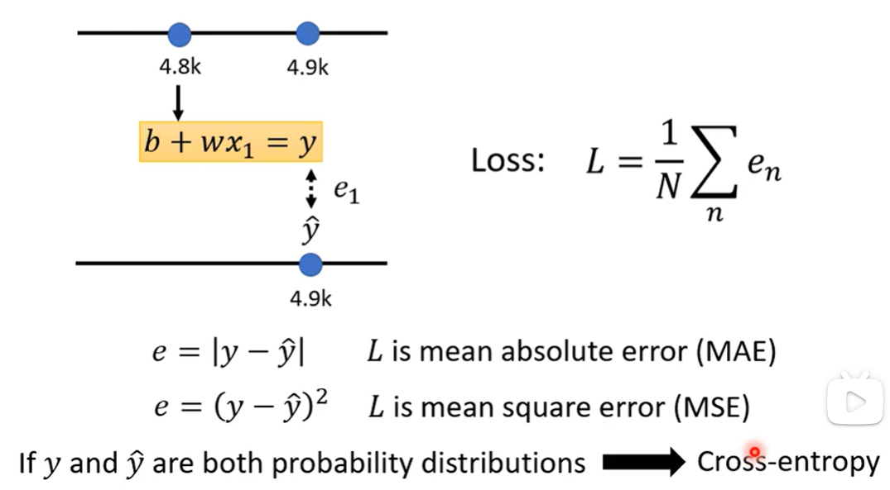
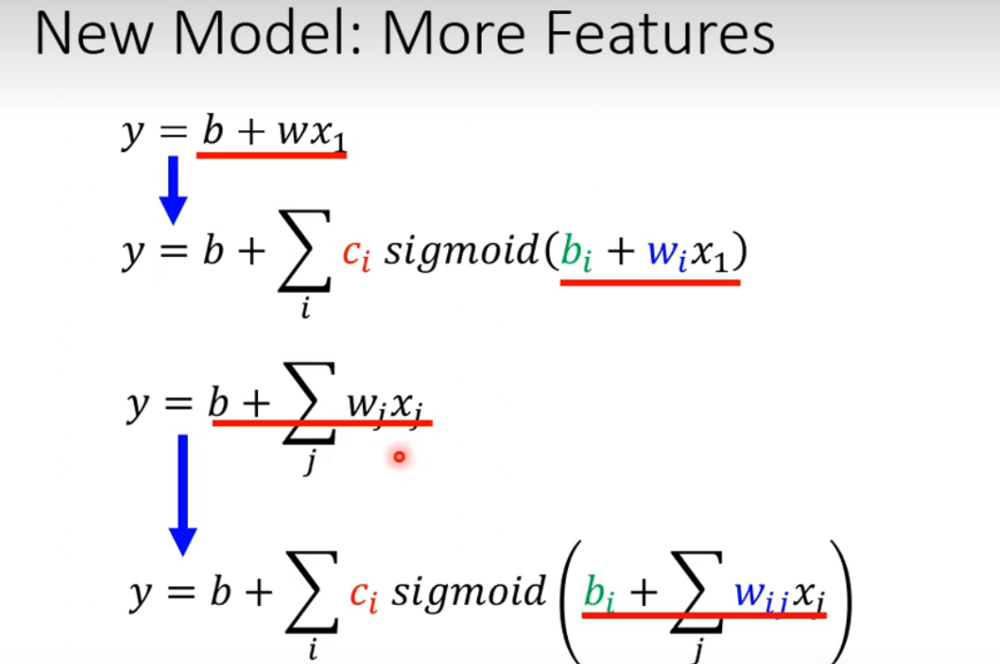

# Lecture 1: 机器学习相关基础

*machine learning ≈ looking for function*

---

#### Different Types of Functions

- Regression: The function output a scalar
- Classification: Given options(classes), the function outputs the correct one.
- Structured Learning: create something with structure(image, document)

---

### How to find the function？

*（这个例子是用2017年到2020年的每天的Youtube频道浏览量来预测后一天的浏览量）*

1. **Function with Unknown Parameters (带有未知参数的函数)**

​	==x是feature，w和b是未知的，w叫weight（权重值），b叫bias（偏置）==

> y= b+w*x^1^ is a function of linear model.

2. **Define Loss From Training Data**

   *Loss is a function of parameters.* ---> L(b,w)

   ==***Loss: how good a set of values is.***==

   

   

   

3. **Optimization w*,b* =arg min L**

​	*Gradient Descent*(梯度下降法):

​	不同的w* 得到不同的Loss

​	<u>η：hyper-parameters 超参数(人为设定)</u>

1. **一个参数**

- randomly pick an initial value w^0^
- compute θL/θw|~w~=w^0^ w^0^--->w^1^--->w^n^
- update w iteratively

*<u>loss最小的地方叫 global minima</u>* 

*<u>loss局部最小的地方叫local minima</u>*

2. **两个参数**的情况

---

Machine Learning is so simple......

#### Step1：function with unknown

​		这只是数据训练，更重要的是用过去的数据去预测未来的数据。

​		预测的数据具有周期性，需要修改一下mod。将用前一天的数据预测后一天的数据修改为前七天的数据来预测后一天的数据。w^i^有不同的权重。

---

##### Linear Models are too simple... we need more sophisticated models. （需要更精密的模型）

Linear models have severe limitation. **==(Model Bias)==**

 All piecewise Linear Curves = constant + sum of a set of 蓝色function

Beyond Piecewise Linear？可以用Piecewise Linear Curves模拟出来

​		**因此，可以用Piecewise Linear Curves 来逼近任何的连续的曲线，而每一个Piecewise Linear Curves可以用一大堆的蓝色function组合得到。** 

###### How to represent this function?

使用Sigmoid Function来逼近Hard Sigmoid（即蓝色function）

<u>different w: Change slopes</u>

<u>different b: Shift</u>

<u>different c: change height</u>

​		改变**==c，b，w==**，然后叠加不同的Sigmoid Function，就可以逼近不同的Piecewise Linear Function，然后Piecewise Linear Function可以拿来近似不同的continuous function。

> 捋一下各个function的关系：
>
> Sigmoid Function --> Hard Sigmoid -->Piecewise Linear Curves-->Continuous Function

叠加得到的continuous Function：

New Model: More Features

r1,r2,r3和wi的关系:（仅仅只是蓝色虚线方框）

可以用非齐次线性方程组表示：

然后对r~i~进行sigmoid(r~i~)仿真，用a=σ(r)来表示：

然后可以得到最终的y=c^T^a+b.

conclusion:

*σ：sigmoid仿真*

*w：不同的权重*

###### Function with unknown parameters：

<u>**新的Step1：**</u>

#### Step2：loss from training data

Loss is a function of aprameters L(θ)

Loss means how good a set of values is.

Given a set of values, then optimization

#### Step3: Optimization of New Model: 

​	θ^*^=argmin L

- (Randomly) pick initial values θ^0^
  1. 对θ作偏微分
- Compute gradient g＝▽L^1^(θ^0^)
- Compute gradient g＝▽L^2^(θ^1^)
- Compute gradient g＝▽L^3^(θ^2^)

**1 epoch = see all the batches once**

Example:

##### Sigmoid->ReLU(Rectified Linear Unit)

统称为activation function(激活函数)

<u>*用ReLU来替代Sigmoid*</u>

可以叠加层次：

叠加不同层次得到的结果：

It is not fancy enough. Let us give it a fancy name! Many layers means Deep-->Deep Learning! 

层数太多可能会引发Overfitting（过拟合）问题

