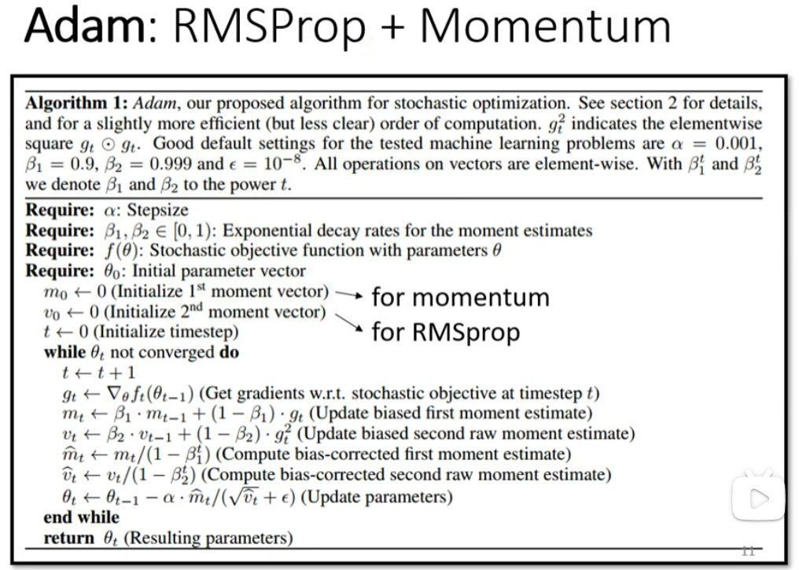

# Adaptive Learning Rate

 <u>*TRAINING TUCK != SMALL GRADIENT*</u>

> 在train的过程中,往往最大的困难不是critical point(因为train的过程中达不到critical point),而是其他问题.

*Training can be difficult even without critical points*

Learning Rate太大和太小都不好

Learning rate cannot be one-size-fits-all.

因此我们需要一个客制化的Learning Rate.

---

### Different parameters needs different learning rate.

> 在某一个方向上,gradient的值很小,那么我们希望把learning rate 调大一点; 反之则调小一点.因此我们需要改一下gradient descend的式子.

##### 方法: Root Mean Square (均方根)

 

可以调整learning rate的大小

##### Learning rate的调整是动态的,因此用到更多的是RMS Prop

- RMS和Root Mean Square的区别: 多了一个参数α, 可以调整每一个gradient descend的权重.

##### 今天最常用的optimization策略是Adam: RMSProp + Momentum 

---

现在来训练with Adaptive Learning Rate

但是为什么后面又会出现幅度过大的问题呢?

可以用Learning Rate scheduling 来解决

##### Learning Rate Scheduling

> t越大,η^t^越小,越接近终点的时候踩刹.

- Learning Rate Decay

  

- Warm Up

  

##### Summary of Optimization

