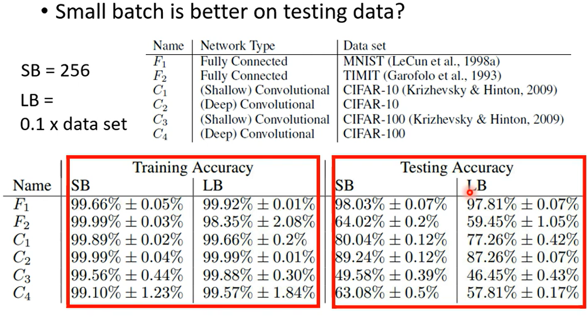

# Batch and momentum

---

Review: Optimization with Batch

---

### Small Batch v.s. Large Batch

- Larger batch size does **not** require longer time to compute gradient.   GPU有平行运算的能力但是当数据量增加到足够大的时候，一次update 的时间还是会大幅增加。

- Smaller batch requires longer time for one epoch(longer time for seeing all data once)  

  

- Smaller batch size has better performance. what's wrong with large batch size?---Optimization Fails

  

- Noisy update is batter for training

- Small batch is better on testing data

  

  

<u>***思考：有没有方法能够结合两种batch的优点呢？？***</u>

---

### Momentum

#### (Vanilla) Gradient Descent

#### Gradient Descent + Momentum

> Movement: movement of **last step** minus gradient at present

'

## Concluding Remarks

