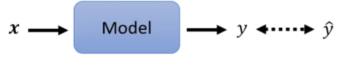
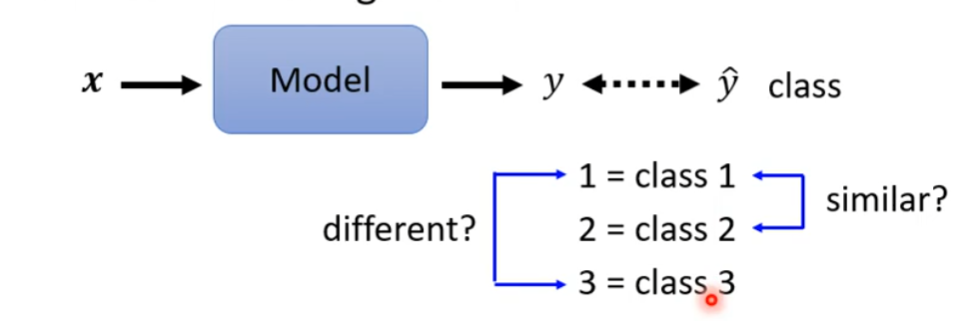
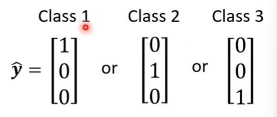
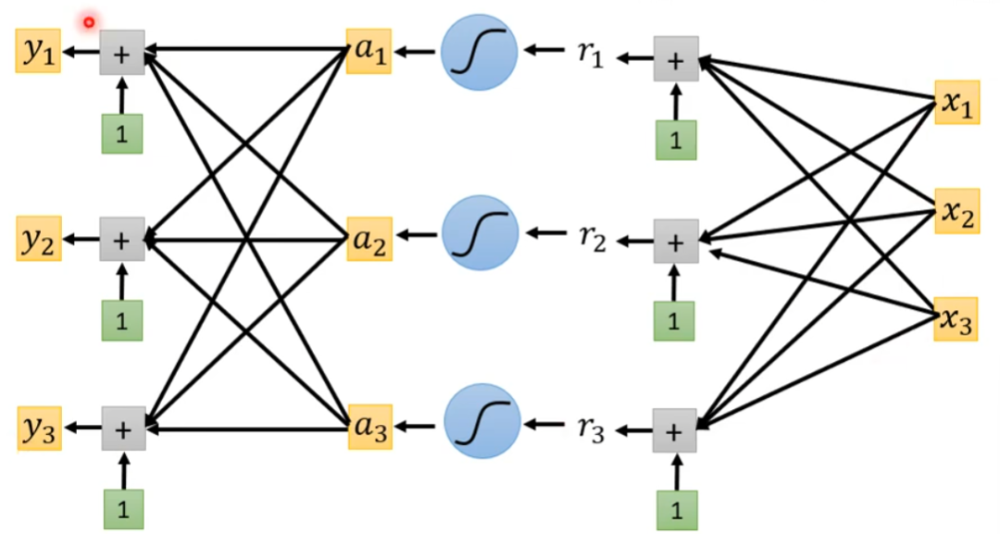
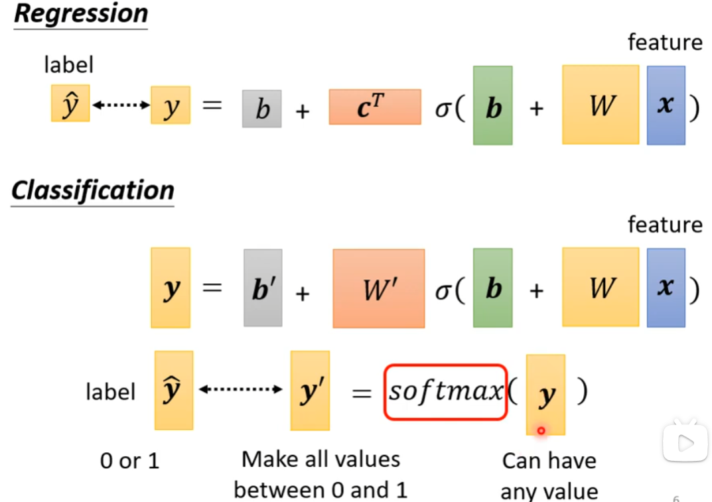
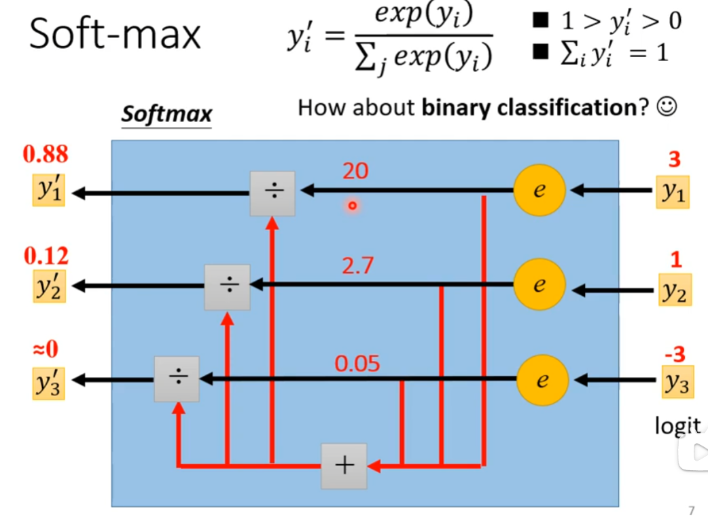
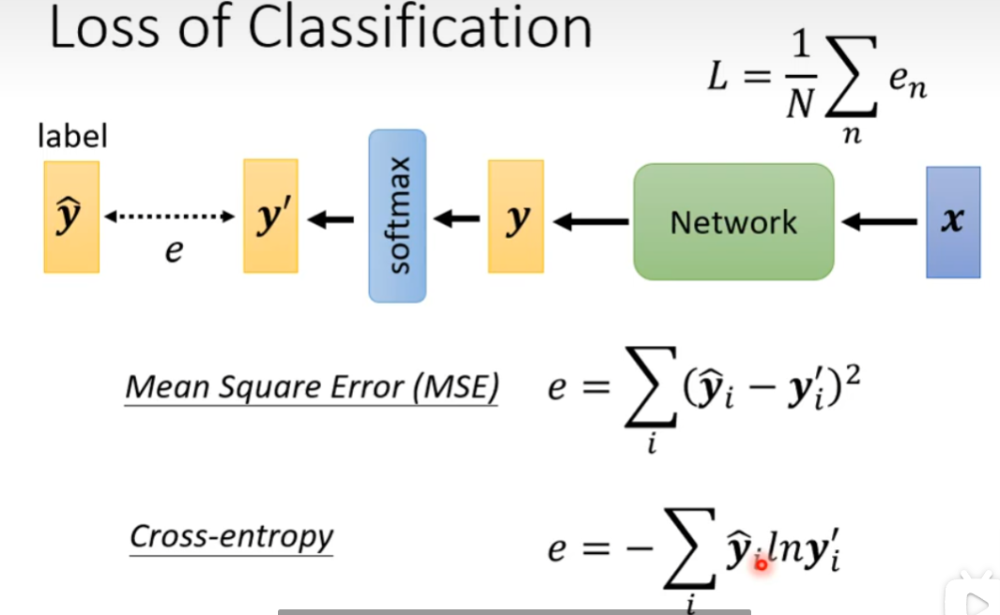
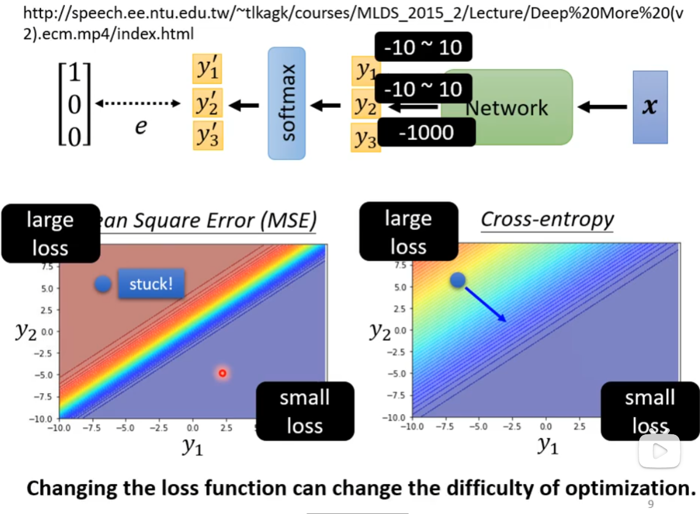

# Classification

#### *Classification as Regression*

- Regression

  

- Classification as regression

  

##### 将Class用one-hot vector(独热编码)来表示

 输出三个数值的神经网络

Regression和Classification

y------->y' 要经过一个softmax的过程,目的是为了将任意的y的值分标准化到0~1之间.

##### softmax的过程是:

$$
y'_i = \frac{exp(y_i)}{Σ_jexp(y_i)}
$$

> 当只有两个class的时候取sigmoid

---

#### Loss of Classification

当然可以用MSE(均方差)来计算Loss,但是有一个更常用的办法就是Cross-entropy(交叉熵)

**`Minimizing cross-entropy is equivalent to maximizing likelihood.`**

Cross-entropy比MSE更加适合用在Classification上.

> softmax内嵌在Cross-entropy里面,不需要再加一次softmax

##### 为什么交叉熵更好呢?

MSE可能会在大Loss的地方卡住,而cross-entropy在大Loss的地方有斜率的,不会卡住.

