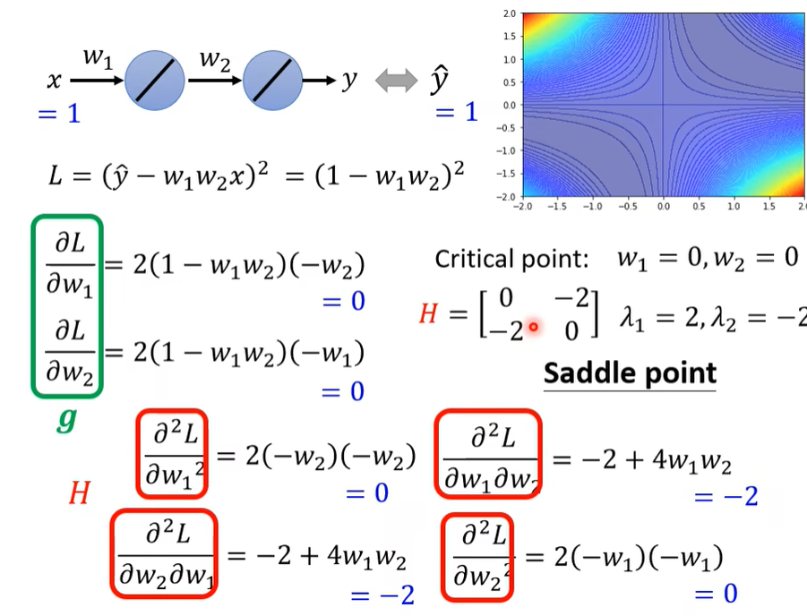

# 机器学习任务攻略

---

## Framework of ML:

- Step 1: function with unknown

- Step 2: loss from training data
- Step 3: opitimization

θ代表所有的未知参数

---

## General Guide

**决策树:**

### Loss on training data is too large.

If loss on **training data** is large, the problem maybe is:

1. model bias
   - solution: make your model complex
2. optimization
   - solution: Next Lecture

#### Model Bias

- model bias: the model is too simple.
- Solution: redesign your model to make it more flexible.
  - more features
  - deep learning(more neurons,layers)

#### Optimization Issue

- Large loss not always imply model bias. There is another possibility...

#### Model Bias v.s.Optimization Issue

*怎么判断是哪一个导致的Loss太大了呢?*

- Gaining the insights from comparison

  

- Start from shallower networks (or other models),which are easier to optimize.

- lf deeper networks do not obtain smaller loss on **training data**,then there is optimization issue.

- example:

- solution: More powerful opitimization technology(next lecture)

---

### Loss on training data is small.

- If loss on **testing data** is large, the problem maybe is:
  1. overfitting
  2. mismatch

#### Overfitting

- Small loss on training data, large loss on testing data. Why?

##### An extreme example:

<!--testing data in training data-->

##### 一般情况下也可能发生类似的事情: 

##### The Solution of Overfitting 

1. 增加训练资料

- Data augmentation(数据增强)

2. constrained model(限制模型)

   

   *<u>you can do that to constrain model:</u>*

   - Less parameters, sharing parameters
   - Less features
   - Early stopping
   - Regularization
   - Dropout

   <u>**如果限制模型太过火了就会回到model bias 问题.**</u>

   

---

#### Bias-Coplexity Trade-off:

The extreme example again:

####  Cross Validation(交叉验证):

*测试集分为测试集和验证集*可以得到更低的loss

##### How to split training set?

- N-fold Cross Validation(N-折交叉验证法)

  

---

#### Mismatch 

- Your training and testing data have different distributions.

***<u>Most HWs do not have this problem, except HW11</u>***

增加资料无法解决mismatch问题

---

### Optimization Fails because(优化失败的原因)

随着参数不断地update但是training loss 不够小.或者无论如何update参数但是training loss没什么变化.其原因之一可能是gradient is close to zero. 这些点统称为critical point.

#### 为什么gradient接近0呢?有两种可能:

- local minima(局部最小值)

- saddle point(鞍点)

  

#### **如何分辨是critical point 卡在了local minima还是saddle point?**

1. local minima: No way to go
2. saddle point: escape

<!--数学上的解释-->

> ## **Warning of Math**
>
> **Talyer Series Approximation**
>
> <u>*L(θ)around.θ=θ' can beapproximated below*</u>在某一点的泰勒展开(注意是多元函数的泰勒展开):
>
> L(θ) ≈ L(θ') + (θ-θ')^T^g + 1/2(θ-θ')^T^H(θ-θ')
>
> - Gradient g is a <u>vector</u>(梯度)
>
> - Hessian H is a <u>matrix</u>(海森矩阵)
>
> 
>
> 此处可参考:[多元函数的泰勒展开式---知乎](https://zhuanlan.zhihu.com/p/33316479)

- 

- #### ==在critical point可以通过红色框框内这一项来知道是local min/max或者是saddle point.==

用红色框框内的内容来判断是Local minima还是local maxima或者是saddle point. 但是这样太麻烦了,对于所有的V而言,我们可以用**H**来判断:

1. H is positive definite Matrix.=> All eigen values are positive.=>Local minima

   H是正定矩阵=>H的所有特征值大于0.=>局部最小值

2. H is negative definite Matrix.=> All eigen values are negative.=>Local maxima

   H是负定矩阵=>H的所有特征值小于0.=>局部最大值

3. Some eigen values are positive, and some are negative.=>Saddle point.

   H的特征值有正有负=>鞍点.

##### Example

> **可以看成是多元函数无条件极值:**

**判断几个点是鞍点还是minima:**

判断critical point: (w~1~,w~2~)=(0,0)是什么点:

**g即一阶导数向量,H即为二阶缓和导数矩阵**

算某一点的混合连续偏导数得到H,求出H的特征值为2和-2,则为鞍点(非极值点)

某点是saddle point,则H也可以解决问题.

*H may tell us parameter update direction!*

假设u是H的特征向量,λ是对应特征向量u的特征值.  

λ<0 => u^T^Hu = u^T^(λu) = λ||u||^2^<0

