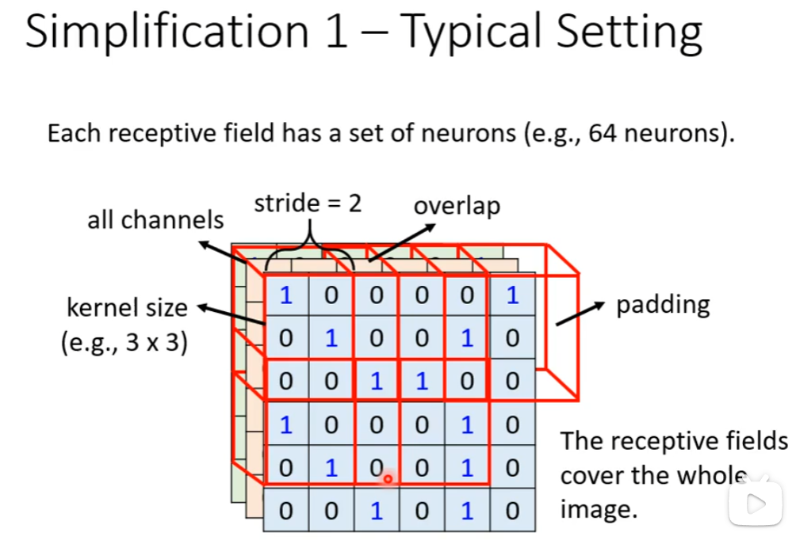
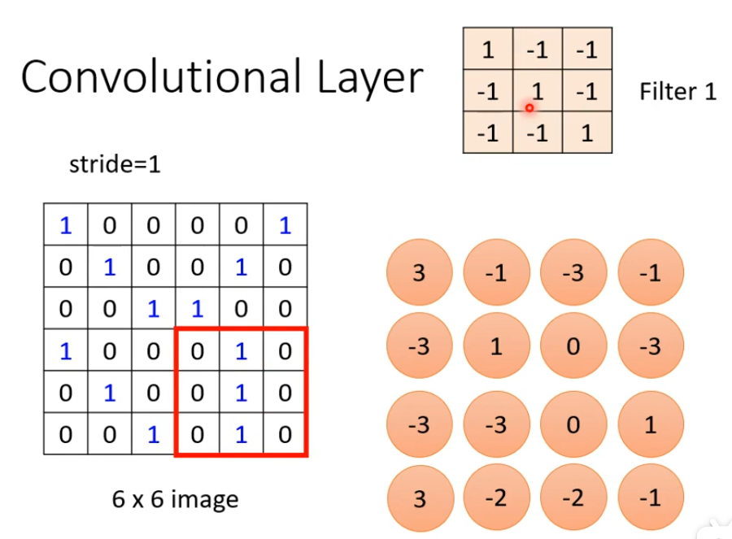

# Convolutional Neural Network*(卷积神经网络CNN)*

*CNN专门被用在影像上*

---

### Image Classification(影像分类)

​	先把所有的图片处理成相同大小的图片.再放到model里面.模型的目标是就是一个one-hot vector---y-,每一个类别就是一个元素.模型的输出经过一个softmax得到一个向量y'.那么希望y'和y-的Cross entropy(交叉熵)越小越好.

​	那么对电脑来说一张图片是一个三维的Tensor(张量). 其中一维代表图片的宽,另外一维代表图片的高,还有一维代表图片的channel的数目.

​	channel的意思是:一张彩色的图片的每一个pixel(像素)都是由RGB三个颜色组成的.所以三个channel就代表了RGB的三个颜色.长宽就代表了这张图片的解析度,代表与图片像素的数目.

​	将三维的Tensor拉直变成一个向量,丢到Network里面.向量的某个元素代表的就是某一个像素某一个RGB色的强度.

​	这个巨大的向量可以当成Fully connected Network的输入.Input Feature Factor的长度就是100x100x3.假设第一层neural的数目是1000个,那么就有3x10^7^个weight(权重).值得思考的是我们真的需要这么多吗?

 	随着参数的增加,可以增加模型的弹性,增加它的能力,但是也增加了overfitting(过拟合)的风险.有时候也并不需要用到这么多参数(Fully Connected Network).

---

#### Observation1

通过识别特征来判断是一只鸟.或许人类也是用同样的方式来识别的.

但是!这是一只猫!

​	看有没有某个特征出现,也许不需要每一个neural看每一张完整的图片.把图片的部分当作输入,就足以让神经网络侦测某些特别的pattern也没有出现.因此可以做简化.

---

#### Simplification1

在CNN里,设定图片的 一个区域叫**`Receptive Field`**,每一个neural都只关心自己Receptive Field(感受野)就可以了. 

这27个元素拉直为一个one-hot vector输出到一个neural里,只有27个weight.

> ### `Tips:`
>
> - 那么Receptive Field怎么决定出来呢? 这个看你自己的定义了.
> - Receptive Field的形状和大小是自己定义的
> - 值得一提的是,同一个图像划分的Receptive Field`可以有大有小`.
> - Receptive Field可以不可以只考虑某一个channel呢?**`可以!`**
> - 完全是你对这个问题的理解来决定Receptive Field是什么样子的.Receptive Field甚至不一定要相连,可以只看左上角或者右上角...
>
> - **Receptive Field `也可以是重叠的`!**
>
> - **同一个范围也可以用多个不同的neural.**
>
> - **Receptive Field 和neural的关系是`1对多`.** 

---

#### 最经典的Receptive Field安排方式:

<u>***(简化全连接神经网络的方式之一)***</u>

- 看所有的channel
- 描述Receptive Field的方式只看长和宽,称之为kernel size(卷积核).
- Each receptive field has a set of neurons (e.g., 64 neurons)
- stride = 2 (包括垂直方向和水平方向)
- 超出的范围要做padding填充(当作都是0或者其他方法)

---

#### Observation2

The same patterns appear in different regions.

每一个范围都要一个侦测鸟嘴的neural network吗?显然不是.

---

#### Parmeter Sharing

***<u>第二个简化参数的方式</u>***

不同Receptive Field的Neural共享参数.权值weight一样的.输出是不一样的.

Two neurons with the same receptive field would not share parameters.

---

#### Simplification2--Typical Setting

- Each receptive field has a set of neurons (e.g.,64 neurons)

- Each receptive field has the neurons with the same set of parameters.(称之为filter).

 

---

#### Benefit of Convolutional Layer

- Some patterns are much smaller than the whole image.
- The same patterns apear in different regions.

---

#### Convolutional Layer(another story based on `filter`)

​	每一个convolutional layer 里面有若干个filter.每一个filter里面都是一个3x3xchannel这么大的Tensor.灭一个filter的作用是取图片里面抓取某一个pattern.

那么filter如何在图片里面抓pattern的呢?

假设channel=1(黑白图像),tensor的数值都知道了(需要通过gradient descend来找出来)

filter设为3x3x1

Filter1放左上角然后算乘法,stride=1,右移一格. 

可以看到filter1 主要找有连续斜线的pattern.

每一个filter作重复的process.

Filter2同样步骤:

假设有64个filter,那么这些得到的就是==Feature Map==

**`Feature Map可以看成是一个 "image" with 64 channels`**

> Convolution可以**`叠很多层`**

假设叠加第二层会发生什么呢?

第二层的convolutional Layer里面有一堆filter,设为3x3x64.

高度设置为64是因为第一层生成的Feature Map的channel是64;而Feature Map的channel取决于第一层的filter的数目即64.

​	question:如果filter的大小一直设置为3x3的话,会不会让network没办法看到更大范围的pattern呢? 答案是不会. 

侦测的范围会越来越大.

comparison of two stories

---

#### Observation3

Subsampling the pixels will not change the object.

举例:把偶数的column拿掉,把奇数的row都拿掉,图片变为原来的1/4,但是图片不会怎么变化.

##### Pooling - Max Pooling(最大池化)

分组选最大的一个:

往往在convolution后后面还会搭配Pooling.

pooling的任务就是把图片变小.

在实际上往往都是convolution和pooling交替使用.

 

the performance of pooling 会差一点.近年来有部分设计会把pooling丢掉,而是做full convolution的neural network.原因是计算力越来越强.

#### The whole CNN

---

#### Application

#####  Playing go

why CNN for Go Playing?

- Some patterns airemuch smaller than the whole image.

  

- Thesame patterns appearin different regions.

  

- Subsampling the pixels will not change the object.How to explain this??

  Playing Go没有用Pooling.

##### More Applications

---

#### To Learn more

CNN is not invariant to scaling and rotation (we need data augmentation.)

  图像放大缩小后甚至不能识别.

  

  

  

  

